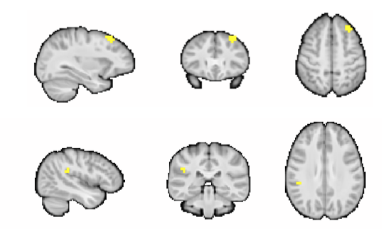

### 1. Subject filtering. 

The pnc subjects were selected from [ Marieta work on apllication of NMF to T1w images ](https://github.com/PennBBL/pehlivanovaPncItcScripts). A total *452  subjects* were used for her final analyses.  Those subjects were screened further for this project. This project only used resting-state data.  

 Criteria used for futher screened are: 
 
 ```
 1. restExcludeVoxelwise
 
 2. restRelMeanRMSMotionExclude
 
 3. resting-state data points are equal for all subjects
 ```
 
A total of *307 subjects* were found to passed all the criteria.

The script `scripts/subjecfiltering.R` used for subject filtering. 


### 2. Get the resting-state data

   
 307 subjects resting-state data were picked from data freeze that passed the screening. 
 The data were downsampled to from 2mm to 4mm as done in previous studies for  improved computational efficiency of `CWASMDMR`.  
 
 The script (`scripts/downsampleniftito4mm.sh`) was used to get the data into 4mm  and prepared 
 the input data (*subjectData/imageinput_rest.csv*) list for *cwasmdmr* computation.

 
### 3. CWASMDMR

The computation of  CWASMDMR was  done with  `cwasmdr` singularity image (`/cbica/projects/GURLAB/applications/bids_apps/cwasmdmr.simg`).

Distance matrix was first computed with this script: `scripts/cwas_pearson.sh`.

The output of distance matrix: `/cbica/projects/GURLAB/projects/pncitc/output/cwas307`
   
The  distance matrix  was used for mdmr computation with `logk` as the main factor.
other covariates used are `sex`, `age`, and `relative rms`:

 ```math  
 distancematrix = f(logk)+relMeanRMSmotion+sex+age 
 ```
   
The script used for mdmr computaion: `scripts/logk_motion_sex_age.sh`
   
### 4. Significant clusters from mdmr
The cluster analysis was computed  with the script `scripts/grf_fslcluster.sh`, written based on  [FSL cluster analysis](https://fsl.fmrib.ox.ac.uk/fsl/fslwiki/Cluster) with  Gaussian Random Field (GRF) theory. 

The script `scripts/clusterz3.0.9.sh` was computed on the z-value obtained from mdmr  with the threshold `z=3.09`
Two clusters was obtained: one at the at the frontal region the order at the TPJ. 



The output of cluster masks: `/cbica/projects/GURLAB/projects/pncitc/output/cluster_Z3.09`


### 5. Seed-based correlation 
The two  masks were upsample from 4mm to 2mm and were used as seeds for seed-based correlation.

the two seeds: 
`/cbica/projects/GURLAB/projects/pncitc/output/cluster_Z3.09/mask1_2mm.nii.gz `
`/cbica/projects/GURLAB/projects/pncitc/output/cluster_Z3.09/mask2_2mm.nii.gz` 

The seed-based correlation was computed with the `scripts/seedcorrelations.sh`

### 6. Linear regression with FSL `flameo` 

Flameo regression computation requires `design`,`contrast` and `group`. The script `scripts/makeflameodesig.R`

The flameo linear regression was computed with the script: `scripts/flameo`
The outputs of flameo regression: 
`/cbica/projects/GURLAB/projects/pncitc/output/seedcorrmaps/mask1`

`/cbica/projects/GURLAB/projects/pncitc/output/seedcorrmaps/mask2`

In each directory, there are zvalues: 

  `zstat1 : average `

  `zstat2 : logk `

  `zstat3 : sex`

  `zstat4 : motion`

  `zstat5 : age`


The zstats  were FDR corrected with this script `scripts/flameoutputfdrcorrection`. The outputs are located here:

`/cbica/projects/GURLAB/projects/pncitc/output/seedcorrmaps/mask1/logk`
`/cbica/projects/GURLAB/projects/pncitc/output/seedcorrmaps/mask2/logk`

FDR corrected z-values. 

  `zfdr1 : average `

  `zfdr2 : logk `

  `zfdr3 : sex`

  `zfdr4 : motion`

  `zfdr5 : age`

### 7. Vizualisation of Results

All computations were done in PNC template. For vizualisation, all the nifti files  were tranformed to MNI before. 

  a. for clusters and mean of seed-based correlation : `notebook/seed-basedcorrelation.ipynb`

  b. for mask1 : `notebook/flameomask1.ipynb`

  c. for mask2 : `notebook/flameomask2.ipynb`


### 8. Regional plot of signitiifcant regions of logk 
 
 The positive and negative zvalues of seed-based correlation regression with logk was extracted with the script `scripts/extractsignificantcluster.R` for both seed masks 

 The results were vizualised with `notebook/meanseedcorrelationplot.Rmd`


 ### 9. next step

 

 


 

   
   

 
 